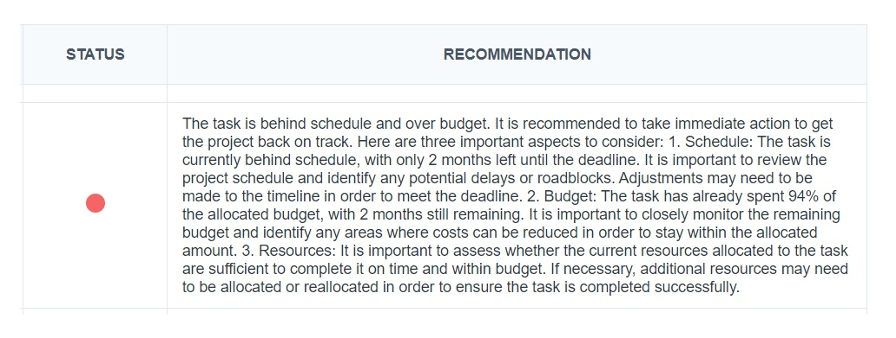

# GenAI-LLM-RAG-bot

In this work, we use Generative AI LLM modeling techniques to create a project management RAG system tool.
RAG is a coloring system that assigns a color (Red, Amber, or Green) to each project task indicating its progress status.

Once the project data is fed into the tool, the LLM model is prompted to provide project management expert recommendation on how to proceed on the task according to its understanding of the data provided.

# Approach

- Utilizing LangChain open source framwork to create the LLM model
- Using OpenAI API as our prompting channel
- The user interface app is created using Flask web frame

# Requirements
- langchain
- OpenAI
- flask
- Pandas
- pydantic==1.10.8

# Using the app
- The app simplifies the RAG system into evaluating the task status based on the spent budget and the task deadline
- The initial project data is added to the package in csv format and saved as "tasks.csv"
- The user can then start the app by running app.py
- To update a task data, the user can access the editing page by clicking the "Update a task" button
- The user defines the number of the task and the budget already spent on the task to date, and then clicks "Update status"
- The LLM is then automatically prompted to evaluate the task status based on the new data and provides updated expert recommendations

